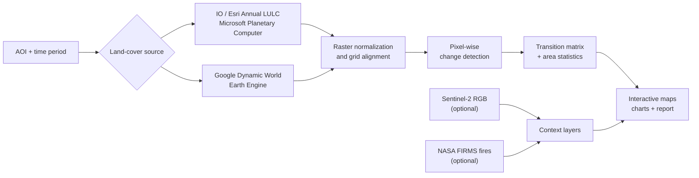

# 🌎 Earth Time Machine

**Interactive geospatial change detection from satellite-derived land-cover data.**

Search or draw any region on Earth, choose two time periods, and Earth Time Machine retrieves land-cover data, detects pixel-level transitions, calculates area statistics, and generates interactive maps and a downloadable report.

[**Open the live app**](https://earth-time-machine.streamlit.app) · [**View the repository**](https://github.com/shourya-9/earth-time-machine)

---

## Overview

Earth Time Machine is a Python geospatial analysis pipeline with a Streamlit interface for exploring how land cover changes over time.

It combines two global 10 m land-cover products:

| Source | Access | Time coverage in the app | Best for |
|---|---|---|---|
| **Impact Observatory / Esri Annual LULC** | Microsoft Planetary Computer | 2017–2024 | Stable year-to-year comparisons |
| **Google Dynamic World** | Google Earth Engine | 2015–present | Recent and shorter-window comparisons |

The core annual workflow uses Microsoft Planetary Computer and does **not require an API key**. Dynamic World and NASA FIRMS are optional integrations.

## Features

- **Global area-of-interest selection** — search for a place, draw a rectangle on the map, or load a preset case study.
- **Two land-cover backends** — annual IO/Esri LULC and near-real-time Google Dynamic World.
- **Pixel-level change detection** — compares aligned land-cover rasters and identifies class transitions.
- **Transition analysis** — calculates changed area, per-class totals, transition matrices, and the largest land-cover changes.
- **Notable-change summaries** — surfaces transitions associated with deforestation, urban growth, agricultural expansion, land reclamation, and clearing.
- **Satellite context** — optional Sentinel-2 RGB previews for the selected area.
- **Fire context** — optional NASA FIRMS active-fire detections for the analysis period.
- **Interactive outputs** — before/after maps, change maps, statistics, transition charts, and a downloadable Markdown report.
- **Multiple interfaces** — Streamlit app, command-line workflow, and Jupyter notebook example.

---

## Architecture



### Change-detection pipeline

For two land-cover rasters covering the same area:

1. Load and normalize the source rasters.
2. Align them to a common grid when necessary.
3. Compare the before/after land-cover class at each valid pixel.
4. Count each `from → to` class transition.
5. Convert pixel counts into approximate area values.
6. Aggregate the results into class totals, top transitions, notable transitions, maps, charts, and a report.

The application uses a shared 9-class legend so IO-LULC and Dynamic World results can pass through the same downstream analysis and visualization pipeline. Dynamic World's grass and shrub/scrub classes are mapped to **Rangeland** for compatibility.

---

## Example analyses

The app includes preset regions so the full workflow can be tested immediately.

| Preset | Period | Analysis focus |
|---|---|---|
| Rondônia, Brazil | 2018 → 2023 | Deforestation and land conversion |
| Dubai, UAE | 2017 → 2023 | Urban expansion and reclamation |
| Bengaluru, India | 2017 → 2023 | Urban sprawl |
| Camp Fire area, California | 2018 → 2022 | Post-fire land-cover change |
| Borneo, Indonesia | 2017 → 2023 | Forest and peatland conversion |

You can also search for a location or draw any custom bounding box directly in the app.

---

## Tech stack

**Application**
- Python
- Streamlit
- Folium / streamlit-folium

**Geospatial processing**
- xarray / rioxarray
- Rasterio
- GeoPandas
- Shapely
- NumPy / Pandas

**Data access**
- Microsoft Planetary Computer
- STAC / `pystac-client`
- `odc-stac`
- Google Earth Engine
- NASA FIRMS

**Visualization**
- Matplotlib
- Plotly
- Folium

---

## Data sources

### Impact Observatory / Esri Annual LULC

The primary annual workflow uses the `io-lulc-annual-v02` collection hosted by Microsoft Planetary Computer.

- 10 m global land-cover product
- Sentinel-2-derived
- 9-class legend
- The application currently exposes **2017–2024**
- Anonymous Planetary Computer access — no API key required

Classes used by the application:

| Code | Class |
|---:|---|
| 1 | Water |
| 2 | Trees |
| 4 | Flooded Vegetation |
| 5 | Crops |
| 7 | Built Area |
| 8 | Bare Ground |
| 9 | Snow/Ice |
| 10 | Clouds |
| 11 | Rangeland |

### Google Dynamic World

Dynamic World provides 10 m land-cover classifications through Google Earth Engine. A classification is generated alongside Sentinel-2 acquisitions, allowing substantially more recent comparisons than the annual IO-LULC workflow.

For a user-selected date window, Earth Time Machine computes the **modal land-cover class per pixel**, then maps Dynamic World's classes onto the shared IO-LULC legend used by the rest of the pipeline.

Dynamic World requires a Google Cloud project with Earth Engine access.

### Sentinel-2 RGB

Optional Sentinel-2 L2A imagery is fetched from Microsoft Planetary Computer and combined into median RGB previews to provide visual context alongside the classified land-cover maps.

### NASA FIRMS

NASA FIRMS can optionally overlay MODIS/VIIRS active-fire detections for the selected analysis period. This is useful as contextual evidence when examining fire-related land-cover changes.

---

## Quick start

### 1. Clone the repository

```bash
git clone https://github.com/shourya-9/earth-time-machine.git
cd earth-time-machine
```

### 2. Create a virtual environment

```bash
python -m venv .venv
source .venv/bin/activate
```

On Windows:

```powershell
.venv\Scripts\activate
```

### 3. Install dependencies

```bash
pip install -r requirements.txt
```

### 4. Run the app

```bash
streamlit run app.py
```

Then open:

```text
http://localhost:8501
```

The standard IO-LULC workflow works without additional credentials.

---

## Optional integrations

<details>
<summary><strong>Google Dynamic World / Earth Engine</strong></summary>

Dynamic World requires a Google Cloud project with the Earth Engine API enabled and Earth Engine access configured.

For local interactive use:

```bash
earthengine authenticate
export EARTHENGINE_PROJECT="your-project-id"
```

For headless or deployed environments, set:

```bash
export GOOGLE_APPLICATION_CREDENTIALS="/path/to/service-account.json"
export EARTHENGINE_PROJECT="your-project-id"
```

The service account must have the permissions required to access Earth Engine through the configured project.

</details>

<details>
<summary><strong>NASA FIRMS fire overlay</strong></summary>

Request a free FIRMS MAP_KEY from:

https://firms.modaps.eosdis.nasa.gov/api/area/

Then export it before starting the app:

```bash
export FIRMS_MAP_KEY="your-key-here"
```

The fire overlay will then be available in the Streamlit interface.

</details>

---

## Other ways to run it

### Command line

Run the included Rondônia case study:

```bash
python examples/amazon_case_study.py
```

Or analyze any custom bounding box:

```bash
python examples/cli.py \
    --bbox -63.2,-10.7,-62.5,-10.1 \
    --before 2018 \
    --after 2023 \
    --name "Rondônia" \
    --out outputs/rondonia
```

### Notebook

```bash
jupyter notebook notebooks/demo.ipynb
```

---

## Project structure

```text
earth-time-machine/
├── app.py
├── requirements.txt
├── packages.txt
├── .streamlit/
│   └── secrets.toml.example
├── src/
│   ├── data.py
│   ├── change_detection.py
│   ├── dynamic_world.py
│   ├── overlays.py
│   └── viz.py
├── examples/
│   ├── amazon_case_study.py
│   └── cli.py
└── notebooks/
    └── demo.ipynb
```

### Core modules

- `src/data.py` — Planetary Computer queries for IO-LULC and Sentinel-2.
- `src/change_detection.py` — raster comparison, area statistics, transition analysis, and report generation.
- `src/dynamic_world.py` — Google Dynamic World access and class remapping through Earth Engine.
- `src/overlays.py` — NASA FIRMS fire-data integration.
- `src/viz.py` — land-cover maps, change maps, RGB previews, and charts.

---

## Limitations

- **Spatial resolution** — both primary land-cover products are nominally 10 m, so small or narrow changes may not be represented reliably.
- **Classification uncertainty** — detected changes are changes in predicted land-cover classes, not direct ground-truth observations.
- **Annual IO-LULC data** — the annual product is not intended for within-year change analysis.
- **Dynamic World class remapping** — grass and shrub/scrub are combined into the shared Rangeland class, so some thematic detail is lost.
- **Approximate area calculations** — per-pixel area is estimated from raster spacing and latitude; reported hectare values should be treated as approximate.
- **Large AOIs** — Earth Engine download limits may require a smaller region or coarser resolution for Dynamic World analyses.
- **Place search** — the map search uses the public OpenStreetMap Nominatim service and is intended for interactive use rather than high-volume geocoding.

---

## Roadmap

Potential extensions include:

- Multi-year land-cover trajectories and animated change maps.
- Additional contextual datasets for explaining detected changes.
- Comparison against geospatial foundation-model classifications for selected regions.

---

## Attribution

- **Impact Observatory / Esri LULC** — © Impact Observatory, Microsoft, and Esri, licensed under CC BY 4.0 and hosted by Microsoft Planetary Computer.
- **Sentinel-2** — Copernicus data, European Union / ESA.
- **Google Dynamic World** — accessed through Google Earth Engine.
- **NASA FIRMS** — MODIS/VIIRS active-fire data.
- **Base maps / geocoding** — OpenStreetMap contributors and CartoDB.

## License

MIT
